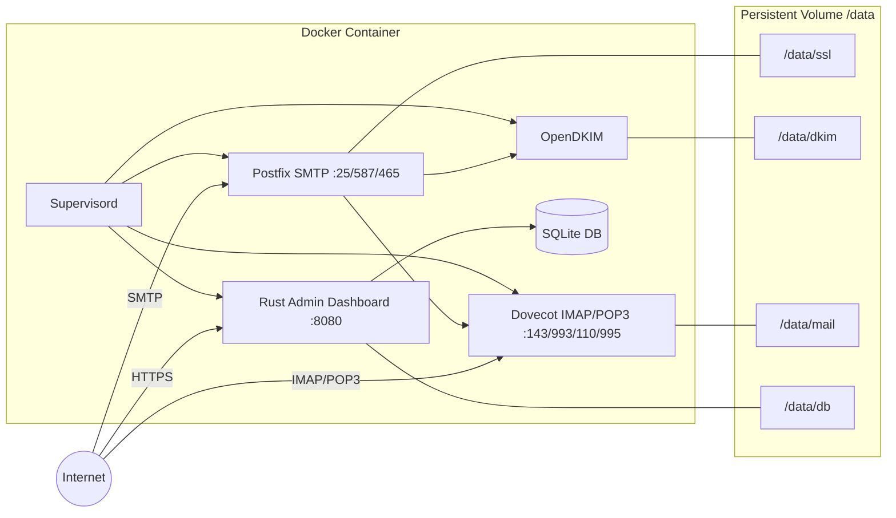

# Mailserver

Single-container mail server with built-in admin dashboard.

Alpine + Postfix + Dovecot + OpenDKIM + Rust.


## Architecture



## Quick Start

**Docker run (one-liner with persistent storage):**

```
docker run -d --name mailserver \
  -p 25:25 -p 587:587 -p 465:465 -p 143:143 -p 993:993 -p 110:110 -p 995:995 -p 443:8080 \
  -v maildata:/data \
  -e HOSTNAME=mail.example.com \
  ghcr.io/tayyebi/mailserver:main
```

**Docker Compose:**

```
cp .env.example .env
docker compose up -d
```

Open `https://your-host:443` for the admin dashboard.

## Default Admin

- **Username:** `admin`
- **Password:** `admin`

Change the password immediately after first login via Settings.

## Authentication

The admin dashboard uses HTTP Basic Authentication (browser prompt).
When 2FA is enabled, append your 6-digit TOTP code to your password.

Example: if password is `secret` and TOTP code is `123456`, enter `secret123456`.

## Configuration

Ports and hostname are set in `.env`. Everything else is managed from the admin dashboard:

- **Domains** — add mail domains, generate DKIM keys, view DNS records
- **Accounts** — create email accounts with passwords and quotas
- **Aliases** — set up email forwarding with per-alias tracking toggle
- **Tracking** — view email open tracking reports
- **Settings** — change admin password, enable/disable 2FA

## Data

All persistent data is stored in the `maildata` Docker volume:

- `/data/ssl/` — TLS certificates (auto-generated self-signed)
- `/data/dkim/` — DKIM signing keys
- `/data/mail/` — mailboxes (Maildir format)
- `/data/db/` — SQLite database

## DNS

Required DNS records for each domain are shown in the admin dashboard under Domains → DNS.
