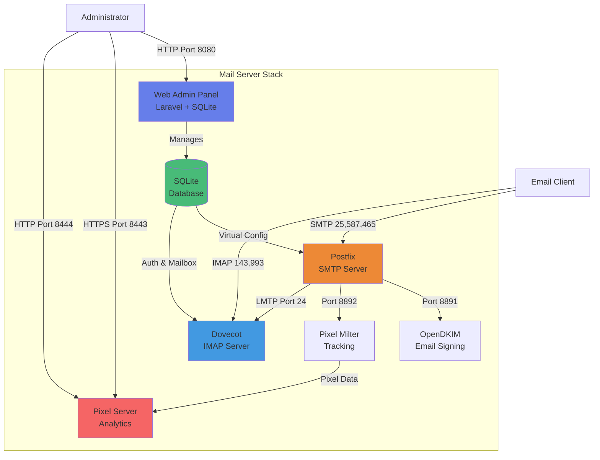

# 📧 Dockerized Postfix + Dovecot + OpenDKIM Mailserver

Self-contained, persistent mail stack with web administration:
- Postfix SMTP (25, 587) with DKIM signing
- Dovecot IMAP/IMAPS and SASL auth
- Dovecot LMTP for final delivery to Maildir
- **Web Admin Panel** for managing domains, email accounts, and aliases
- Shared TLS certificates (read-only) for Postfix and Dovecot
- Multi‑domain sending/signing with simple Make targets

---

## System Architecture



---

## Admin Panel Screenshots

### Dashboard


### Create Email Account


---

## Features

### Web Administration Panel
- 🎨 **Clean UI** - Simple, responsive interface with NO JavaScript
- 🏢 **Domain Management** - Add and configure email domains
- 👥 **Email Accounts** - Create mailboxes with passwords and quotas
- 🔄 **Aliases** - Set up email forwarding and catch-all addresses
- 📊 **Dashboard** - View statistics at a glance
- 💾 **SQLite Database** - Lightweight, file-based storage

### Mail Server Features
- 📧 SMTP sending and receiving (ports 25, 587, 465)
- 📬 IMAP access (ports 143, 993)
- 🔐 DKIM email signing for authenticity
- 📊 Email tracking with pixel insertion
- 🗂️ Maildir storage format

---

## Prerequisites

- Docker and Docker Compose
- GNU Make

Install GNU Make:
- Debian/Ubuntu: `sudo apt update && sudo apt install make`
- Fedora/RHEL: `sudo dnf install make` (or `sudo yum install make`)
- Arch: `sudo pacman -S make`
- macOS: `brew install make` (use `gmake` if installed as GNU Make)
- Windows: use WSL (then follow Linux), or MSYS2 (`pacman -S make`)

Verify: `make --version`

---

## Install

```bash
# Clone and enter
git clone https://github.com/tayyebi/mailserver mailserver
cd mailserver

# Create config from template
cp .env.example .env
# Edit: MAIL_DOMAIN, MAIL_HOST, TZ

# One‑shot bootstrap (idempotent)
make install

# Start admin panel
docker-compose up -d admin
```

`make install` will:
- Ensure data directories exist
- Generate self‑signed TLS certs if missing
- Start opendkim, dovecot, and postfix
- Run health checks

The admin panel will be available at `http://your-server:8080`

---

## DNS checklist

- A: MAIL_HOST → server public IP
- MX: your domain(s) → MAIL_HOST
- PTR: reverse DNS → MAIL_HOST
- SPF (TXT at domain): `v=spf1 a mx ~all`
- DKIM (TXT at default._domainkey.domain): value from `data/opendkim/keys/<domain>/default.txt`
- DMARC (TXT at _dmarc.domain): `v=DMARC1; p=quarantine; rua=mailto:dmarc@domain; fo=1`

---

## Data layout (persistent)

- data/ssl — TLS certs/keys (shared read‑only by Postfix and Dovecot)
- data/postfix — Postfix configs and maps (virtual, virtual_domains)
- data/spool — Postfix queue
- data/opendkim/keys — DKIM keys (per domain)
- data/opendkim/conf — DKIM tables and config
- data/dovecot — Dovecot state/indexes
- data/dovecot-conf — Dovecot config (dovecot.conf, users)
- data/mail — Maildir storage: data/mail/<domain>/<user>/{cur,new,tmp}
- data/pixel — Pixel tracking data and socket directory

---

## Pixel Tracking (pixelmilter)

The mailserver includes pixel tracking functionality that injects tracking pixels and domain-wide footers into HTML emails to track opens.

### Configuration

Pixel tracking can be configured via environment variables in your `.env` file:

- `TRACKING_REQUIRES_OPT_IN` (default: `false`): If `false`, tracking is enabled by default for all HTML emails. If `true`, tracking only occurs when emails include an opt-in header (see `OPT_IN_HEADER`).
- `OPT_IN_HEADER` (default: `X-Track-Open`): Header name to check for opt-in when `TRACKING_REQUIRES_OPT_IN=true`.
- `PIXEL_BASE_URL` (default: `https://${MAIL_HOST}:8443/pixel?id=`): Base URL for tracking pixels.
- `DISCLOSURE_HEADER` (default: `X-Tracking-Notice`): Header name for privacy disclosure.
- `INJECT_DISCLOSURE` (default: `true`): Whether to inject disclosure header into tracked emails.
- `PIXEL_MILTER_ADDRESS` (default: `0.0.0.0:8892`): Address and port for the milter service.

**Example `.env` configuration for domain-wide tracking (default):**
```bash
TRACKING_REQUIRES_OPT_IN=false
PIXEL_BASE_URL=https://mail.gordarg.com:8443/pixel?id=
```

**Example `.env` configuration for opt-in only tracking:**
```bash
TRACKING_REQUIRES_OPT_IN=true
OPT_IN_HEADER=X-Track-Open
```

### Verifying pixelmilter Configuration

To ensure pixelmilter is correctly applied to the whole project:

```bash
make verify-pixelmilter
```

This command checks:
- pixelmilter container is running
- Socket file exists and is accessible
- Postfix configuration includes pixelmilter
- Postfix can communicate with pixelmilter

### Updating Configuration Files (.cf files)

Postfix configuration files (`main.cf`, `master.cf`) are generated from templates (`.tmpl` files) when the container starts. To ensure configuration files are updated after editing templates:

**Option 1: Use the update-config target (recommended)**
```bash
make update-config
```

This will:
1. Rebuild the Postfix container to apply template changes
2. Restart Postfix to load the new configuration
3. Verify the configuration is valid
4. Reload Postfix to apply changes

**Option 2: Manual restart**
```bash
# Rebuild and restart Postfix
docker-compose build postfix
docker-compose restart postfix

# Or restart all services
make restart
```

**Option 3: Reload only (if no template changes)**
```bash
make reload
```

### Configuration File Locations

- **Templates**: `postfix/main.cf.tmpl`, `postfix/master.cf.tmpl`
- **Rendered configs**: Generated inside the Postfix container at `/etc/postfix/main.cf`, `/etc/postfix/master.cf`
- **Pixelmilter connection**: TCP port 8892 (configurable via `PIXEL_MILTER_ADDRESS` environment variable)

### Pixelmilter Integration

Pixelmilter is configured in `postfix/main.cf.tmpl`:
- `smtpd_milters` includes `inet:${PIXEL_MILTER_IP}:8892` for incoming mail
- Pixelmilter listens on TCP port 8892 (configurable via `PIXEL_MILTER_ADDRESS` environment variable)
- Postfix connects to pixelmilter via the Docker network using the `PIXEL_MILTER_IP` address

After modifying `main.cf.tmpl` or `master.cf.tmpl`, always run `make update-config` to apply changes.

---

## Administration Panel

The mailserver includes a simple Laravel-based web admin panel for managing domains, email accounts, and aliases.

### Access the Admin Panel

1. **Start the admin service**:
   ```bash
   docker-compose up -d admin
   ```

2. **Access the interface**:
   Open your browser to `http://your-server:8080`

### Features

- **No Authentication Required** - Direct access for simplicity
- **No JavaScript** - Pure HTML forms, works everywhere
- **SQLite Database** - Lightweight file-based storage
- **Full CRUD Operations**:
  - Create, edit, delete domains
  - Manage email accounts with passwords and quotas
  - Configure email aliases and forwarding

### Quick Start

1. **Add a Domain**:
   - Navigate to "Domains" → "Add Domain"
   - Enter domain name (e.g., `example.com`)
   - Click "Create Domain"

2. **Create Email Account**:
   - Navigate to "Email Accounts" → "Add Email Account"
   - Select domain, enter username and password
   - Set quota (0 = unlimited)
   - Click "Create Account"

3. **Set Up Alias** (Optional):
   - Navigate to "Aliases" → "Add Alias"
   - Set source (e.g., `info@example.com`)
   - Set destination (e.g., `admin@example.com`)
   - Click "Create Alias"

### Database Location

The admin panel stores all data in:
```
data/admin/database.sqlite
```

Regular backups of this file are recommended.

---

## Security notes

- Replace self‑signed TLS cert with a real one when ready (overwrite in data/ssl and `docker compose restart mail dovecot`)
- Never commit .env, keys, or mail data
- Consider firewalling 25/587/993 as appropriate

---

## Troubleshooting

For detailed troubleshooting steps, diagnostic commands, and common issues, please refer to [TROUBLESHOOTING.md](TROUBLESHOOTING.md).