# 📧 Dockerized Mail Server

Self-contained mail stack: Postfix · Dovecot · OpenDKIM · Pixel Tracking · Web Admin.

## Architecture

```mermaid
graph TB
    subgraph "Docker Compose Stack"
        Init[Init ▸ one-shot<br/>Creates dirs & SSL certs]
        Proxy[Nginx Reverse Proxy<br/>:80 → :443]
        Admin[Admin Panel<br/>Laravel + SQLite]
        Postfix[Postfix<br/>SMTP :25 :587 :465]
        Dovecot[Dovecot<br/>IMAP :993 · POP3 :995]
        OpenDKIM[OpenDKIM<br/>DKIM signing :8891]
        PixelMilter[Pixel Milter<br/>Tracking injection :8892]
        PixelServer[Pixel Server<br/>Open tracking :8443]
    end

    User[Admin] -->|HTTPS| Proxy
    Proxy -->|/admin| Admin
    Proxy -->|/pixel| PixelServer
    Proxy -->|/admin/reports| PixelServer

    Client[Email Client] -->|SMTP| Postfix
    Client -->|IMAP/POP3| Dovecot

    Postfix -->|DKIM sign| OpenDKIM
    Postfix -->|Pixel inject| PixelMilter
    Postfix -->|LMTP :24| Dovecot
    Admin -->|SQLite| Postfix
    Admin -->|SQLite| Dovecot
    Init -.->|data/| Postfix
    Init -.->|data/| Dovecot

    style Init fill:#48bb78
    style Proxy fill:#f093fb
    style Admin fill:#667eea
    style Postfix fill:#ed8936
    style Dovecot fill:#4299e1
    style PixelServer fill:#f56565
```



## Quick Start

```bash
git clone https://github.com/tayyebi/mailserver && cd mailserver
cp .env.example .env        # edit MAIL_DOMAIN, MAIL_HOST, ADMIN_BASIC_AUTH_PASSWORD
docker compose up -d         # init service auto-creates data dirs & self-signed SSL
```

That's it. The `init` service runs once, creates `data/` directories and a self-signed
TLS certificate (if missing), then exits. All other services wait for it.

| URL | Description |
|---|---|
| `https://<MAIL_HOST>/admin` | Admin panel (HTTP Basic Auth) |
| `https://<MAIL_HOST>/pixel` | Pixel tracking endpoint |
| `https://<MAIL_HOST>/admin/reports` | Tracking reports API |

## DNS Records

| Type | Name | Value |
|---|---|---|
| A | `MAIL_HOST` | Server public IP |
| MX | `MAIL_DOMAIN` | `MAIL_HOST` |
| PTR | Server IP | `MAIL_HOST` |
| TXT | `MAIL_DOMAIN` | `v=spf1 a mx ~all` |
| TXT | `default._domainkey.DOMAIN` | DKIM public key (generate in admin panel) |
| TXT | `_dmarc.DOMAIN` | `v=DMARC1; p=quarantine; rua=mailto:dmarc@DOMAIN; fo=1` |

## Ports

| Port | Protocol | Service |
|---|---|---|
| 80 / 443 | HTTP / HTTPS | Nginx reverse proxy |
| 25 | SMTP | Postfix (receiving) |
| 587 | Submission | Postfix (sending, STARTTLS) |
| 465 | SMTPS | Postfix (sending, implicit TLS) |
| 143 / 993 | IMAP / IMAPS | Dovecot |
| 110 / 995 | POP3 / POP3S | Dovecot |

All ports are configurable via `.env`. See `.env.example` for the full list.

## Persistent Data

All state lives under `data/` (auto-created on first run):

```
data/
├── ssl/           TLS certificates (shared by Postfix, Dovecot, Pixel Server)
├── admin/         SQLite database
├── mail/          Maildir storage
├── dovecot/       passwd file
├── opendkim/      DKIM keys
├── pixel/         Tracking data
├── nginx-ssl/     Reverse proxy self-signed cert
├── mail-config/   Synced Postfix/Dovecot configs
└── logs/          dovecot, postfix, nginx access/error logs
```

## Configuration

Edit `.env` — all services read from it via `env_file`. Key variables:

```bash
MAIL_DOMAIN=example.com
MAIL_HOST=mail.example.com
ADMIN_BASIC_AUTH_USER=admin
ADMIN_BASIC_AUTH_PASSWORD=change_me
```

Config files (nginx, postfix templates, dovecot, opendkim) are **bind-mounted**
from the repo — edit on host, restart the container, no rebuild needed.

## Security Notes

- Replace `data/ssl/cert.pem` + `key.pem` with a real certificate when ready
- Never commit `.env`, `data/`, or DKIM keys
- Firewall ports as appropriate